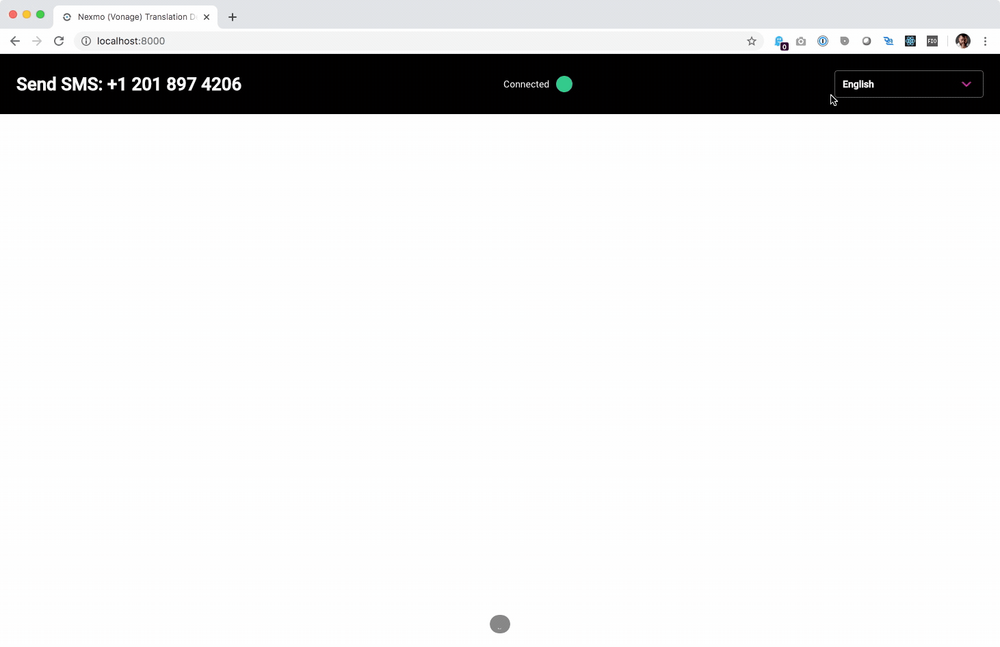

# Real-Time Google Translate SMS Demo Application

This project uses Node, React, Google Translate and Nexmo to create a real-time SMS translation demo application. Using a websocket, incoming text messages are sent to Google Translate API and then forwarded to the front-end application for display.

## Welcome to Nexmo

If you're new to Nexmo, you can [sign up for a Nexmo account](https://dashboard.nexmo.com/sign-up?utm_source=DEV_REL&utm_medium=github&utm_campaign=github-repo) and get some free credit to get you started.

### Setup Google Cloud

Enable the [Google Cloud Translation API](https://console.cloud.google.com/apis/library/translate.googleapis.com?q=translate&id=c22f20ba-6a29-40ae-9084-8bc264a97fc2) and create a service user with the `Project > Owner` role. Download the `google_creds.json` file for the service user. More information can be found here -> [https://cloud.google.com/translate/docs/quickstart-client-libraries](https://cloud.google.com/translate/docs/quickstart-client-libraries)

### Create Nexmo Phone Number

For this demo app, a Nexmo number and SMS webhook are required. This can be setup with the Nexmo CLI. Install the CLI by following [these instructions](https://github.com/Nexmo/nexmo-cli#installation). Once installed, you can purchase a new virtual number from the terminal.

```
nexmo number:buy --country_code US
```

Copy the phone number down for the next step.


### Running Locally

#### Create .env File

You will need a small `.env` file to handle a couple configuration items.

1. Run `touch .env`
1. Copy and paste the following:
    ```
    GOOGLE_APPLICATION_CREDENTIALS=./google_creds.json
    REACT_APP_PHONE_NUMBER=12018974206
    REACT_APP_COUNTRY_CODE=US
    ```
1. Add your Nexmo number

#### Node

Run the following command in a terminal to start your application:

```
npm install && npm run prod
```

This will build the React application and start the Express server on port 8000.


#### Docker

If using Docker is preferred, you can start the application buy building the image and then starting a container:

```
docker build -t nexmo-demo-app ./
docker run -p 8000:8000 nexmo-demo-app
```

#### Ngrok

Expose the application to the internet using tools like [ngrok](https://ngrok.com/). To see how, [check out this guide](https://www.nexmo.com/blog/2017/07/04/local-development-nexmo-ngrok-tunnel-dr/).

1. Run `ngrok http 8000`
1. Copy the forwarding address to update the webhook route. `https://********.ngrok.io`

### Update Nexmo Inbound SMS Webhook

Using the Nexmo CLI, link the previously created phone number with the ngrok forwarding address:  

```
nexmo link:sms phone_number https://********.ngrok.io
```

Also take note: this application uses a `POST` webhook for Inbound SMS.  Be sure to select `POST` in your settings.

## Try it out

With the application running, enter `http://localhost:8000` in your browser. Select a language in the upper right drop down menu, and send an SMS message to the phone number you purchased.  The screen will respond with a translation of your text message in real-time.



## Getting Help

We love to hear from you so if you have questions, comments or find a bug in the project, let us know! You can either:

* Open an issue on this repository
* Tweet at us! We're [@NexmoDev on Twitter](https://twitter.com/NexmoDev)
* Or [join the Nexmo Community Slack](https://developer.nexmo.com/community/slack)

## Further Reading

* Check out the Developer Documentation at <https://developer.nexmo.com>

<!-- add links to the api reference, other documentation, related blog posts, whatever someone who has read this far might find interesting :) -->


